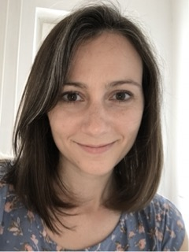

I am a postdoc in Dr. Audrey Bürki's lab, Cognitive Science: Language and Methods, at the University of Potsdam in Germany. My position is funded by the [SFB project Limits of Variability in Language.](https://www.uni-potsdam.de/de/sfb1287/uebersicht)

I received my PhD in Speech, Language, and Hearing Sciences in July of 2020 from University of Connecticut in the United States. I was a member of the [Language and Brain Lab](https://myerslab.uconn.edu) under the direction of Dr. Emily Myers, who was my primary advisor.

<!-- Broadly, I'm interested in how we speak and how we understand other people when they speak. Everyday conversations usually feel pretty effortless, so we may not notice all the work our brains are doing to allow us to speak and comprehend what others are saying. However, speaking and listening are actually complex processes, and we still have a lot to learn about how they work. -->

I am interested in perceptual learning of second-language speech sounds and how phonetic variability in the speech signal can affect learning and memory for those sounds. My work also seeks to better understand individual differences in speech perception, perceptual learning of speech, and speech production. So far I have gone about this by testing whether language ability, cognitive skills, or individual variation in brain structure (using MRI) predict individual differences in performance on various speech tasks.

I am a big fan of open science, and I've made my data and analysis code for my recent projects publicly available at [my OSF page](https://osf.io/m5ezq/).

In addition to being a researcher, I am an avid runner, and I enjoy tasting good wines, watching crime shows, and above all spending time with my husband, Garrett, and our tiny singapura cat, Maja.

---
#### Contact

pamela dot fuhrmeister at uni hyphen potsdam dot de  
pamfuhrmeister at gmail dot com
