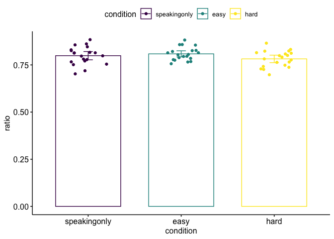

#### This page is still in progress. There will be more to come!

<!-- 
 -->

<!-- <a href="projects/analyses_driving_sim.html"> -->
<!--    -->
<!--   
NLP analyses in R and Python
 -->
<!-- </a> -->

<!-- <a href="projects/k-means-cluster-analysis.html"> -->
<!--    -->
<!--   
k-means cluster analysis
 -->
<!-- </a> -->

<!-- <a href="projects/4_parameter_logistic_model.html"> -->
<!--      -->
<!--     
4-parameter logistic regression model
 -->
<!--   </a> -->

<!-- 
 -->

<a href="projects/analyses_driving_sim.html" target="_blank">

NLP analyses in R and Python

</a>

<a href="projects/k-means-cluster-analysis.html" target="_blank">

k-means cluster analysis

</a>

<a href="projects/4_parameter_logistic_model.html" target="_blank">

4-parameter logistic regression model

</a>

